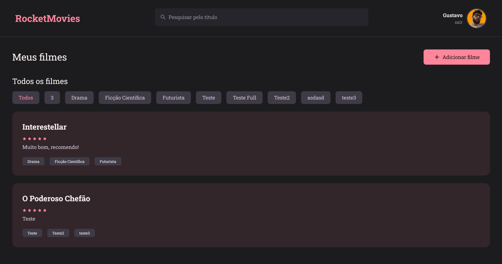

<h1 align="center"> 
  Projeto completo - RocketMovies (Desafio 10 - Explorer)
</h1>

## 💻 Projeto

O RocketMovies é um projeto para cadastro de anotações de filmes, desenvolvido durante o curso Explorer da Rocketseat.

Me desafiei a desenvolver o prejeto utilizando o framework TailwindCSS, que é um framework de CSS que utiliza classes para estilizar os componentes e TypeScript, que é um super set do JavaScript que adiciona tipagem estática.

## Funcionalidades desenvolvidas:

- Criar uma nova conta
- Logar na aplicação
- Cadastro de anotações de filmes; Título, Nota de 0 a 5, Observações, e tags que representam o gênero do filme.
- Pesquisar por títulos das anotações.
- Editar o perfil do usuário; foto, nome, email e senha.

## Funcionalidades extras desenvolvidas (Desafios pessoais):

- Utilizar o framework TailwindCSS ✅
- Utilizar o TypeScript ✅
- Filtrar as anotações por gênero (Tags) ✅
- Excluir uma anotação ✅
- Responsividade para mobile. ✅

  <a href="#-tecnologias">Tecnologias</a>&nbsp;&nbsp;&nbsp;|&nbsp;&nbsp;&nbsp;
  <a href="#-projeto">Projeto</a>&nbsp;&nbsp;&nbsp;&nbsp;&nbsp;&nbsp;</a>

 

## 🎨 Layout

  

## 🚀 Tecnologias

Esse projeto foi desenvolvido com as seguintes tecnologias:

- [React](https://reactjs.org)
- [TypeScript](https://www.typescriptlang.org/)
- [Vite](https://vitejs.dev/)
- [TailwindCSS](https://tailwindcss.com/)
- [React Router Dom](https://reactrouter.com/web/guides/quick-start)
- [react-icons](https://react-icons.github.io/react-icons/)

## 🚀 TODO:

- [ ] Deploy do projeto.

---

Feito com ♥ by Gustavo Batista :wave: [LinkedIn](https://www.linkedin.com/in/gustavo-h-batista/) e [GitHub](https://github.com/gustavohdab)
